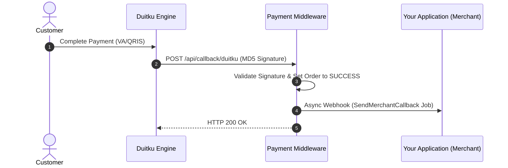

# 🇮🇩 Duitku Payment Gateway Integration

Duitku is a comprehensive Indonesian payment aggregator supporting Virtual Accounts, QRIS, E-Wallets, Retail Outlets, and Credit Cards.

---

## ⚡ Integration Modes (Codebase Implementation)

| Mode | Status | Technical Implementation in Codebase |
|:---|:---:|:---|
| **🪟 Duitku POP / Hosted URL** | ✅ `Supported` | Invokes `Pop::createInvoice()` when `paymentMethod` is omitted, returning a Duitku POP payment URL for modal/redirect checkout. |
| **⚡ Direct API (Headless API)** | ✅ `Supported` | Invokes `DuitkuRepository->createInvoice()` when `paymentMethod` is specified (e.g. `VA`, `BT`, `OV`, `DA`, `SP`), returning direct `vaNumber` / `qrString`. |

---

## 1. Credentials Configuration

In the Backoffice under **Payment Repositories**, configure a repository with the gateway key `duitku` using the following JSON schema:

```json
{
  "duitku_mc": "D12345",
  "duitku_mk": "abcdef0123456789abcdef0123456789"
}
```

### Parameter Description:
| Key | Type | Required | Description |
|:---|:---|:---:|:---|
| `duitku_mc` | string | Yes | Merchant Code provided in the Duitku Merchant Dashboard. |
| `duitku_mk` | string | Yes | Merchant Key (API Key) generated in the Duitku Dashboard. |

---

## 2. Order Creation Flow

Endpoint for creating payment orders:

**`POST /api/order/create`**

### Headers:
```http
Content-Type: application/json
Token: <YOUR_PROJECT_TOKEN>
```

### Request Payload (Direct API with Payment Method):
```json
{
  "paymentRepositoryId": "019e8383-880a-7249-b9da-079b9844de25",
  "merchantOrderId": "ORDER-1001",
  "paymentAmount": 150000,
  "paymentMethod": "VA",
  "productDetails": "Premium Subscription Tier",
  "mode": "sandbox",
  "firstName": "John",
  "lastName": "Doe",
  "email": "john.doe@example.com",
  "phone": "08123456789",
  "address": "Jakarta, Indonesia",
  "returnUrl": "https://yourapp.com/payment/finish",
  "expiryPeriod": 1440
}
```

### Response (Direct API & Hosted Link):
```json
{
  "status": true,
  "code": 200,
  "message": "Success Create Order Duitku",
  "link": "https://sandbox.duitku.com/webapi/...",
  "result": {
    "reference": "PROJ-ORDER-1001",
    "paymentUrl": "https://sandbox.duitku.com/webapi/...",
    "vaNumber": "8808123456789012",
    "qrString": null,
    "amount": 150000,
    "statusCode": "00",
    "statusMessage": "SUCCESS"
  }
}
```

> [!TIP]
> - **Hosted Checkout (Duitku POP)**: Leave `paymentMethod` empty or omitted to let customers select their payment method on Duitku's hosted checkout page.
> - **Direct Headless API**: Pass specific `paymentMethod` codes (e.g., `VA`, `BT`, `OV`, `DA`, `SP`) to obtain the Virtual Account number or QRIS string directly in the JSON response.

---

## 3. Webhook / Callback Handling

Duitku sends HTTP POST notifications to the middleware callback endpoint:

**`POST /api/callback/duitku`**



### Signature Verification:
The middleware validates the MD5 signature:
`MD5(merchantCode + amount + merchantOrderId + merchantKey)`

---

## 4. Status Check Endpoint

Inquire real-time order status:

**`GET /api/order/checkOrderStatus?reference=PROJ-ORDER-1001`**

### Headers:
```http
Token: <YOUR_PROJECT_TOKEN>
```
