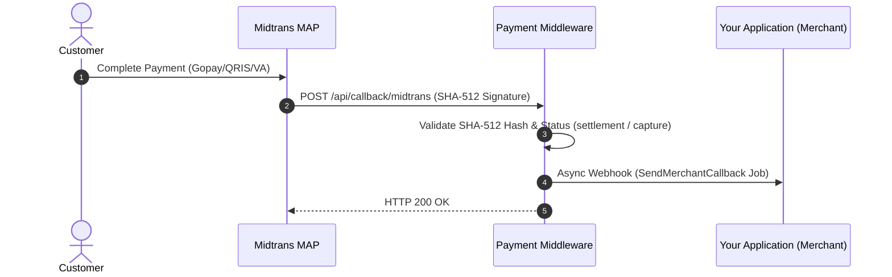

# 🇮🇩 Midtrans Payment Gateway Integration

Midtrans is an enterprise payment infrastructure supporting Snap Popup Modals, Hosted Redirect URLs, Virtual Accounts, QRIS / GoPay, ShopeePay, and Credit Cards.

---

## ⚡ Integration Modes (Codebase Implementation)

| Mode | Status | Technical Implementation in Codebase |
|:---|:---:|:---|
| **🪟 Midtrans Snap (Popup / Redirect)** | ✅ `Supported` | Makes an HTTP POST request to the configured Snap API endpoint (`midtrans_url`) and returns the Snap `token` and `redirect_url`. |
| **⚡ Direct API (Core API)** | 🔄 `Via Snap API` | The current service routing executes via the Snap Transaction API. |

---

## 1. Credentials Configuration

In the Backoffice under **Payment Repositories**, configure a repository with the gateway key `midtrans` using the following JSON schema:

```json
{
  "midtrans_serverkey": "SB-Mid-server-xxxxxxxxxxxxxxxx",
  "midtrans_url": "https://app.sandbox.midtrans.com/snap/v1/transactions",
  "midtrans_clientkey": "SB-Mid-client-xxxxxxxxxxxxxxxx"
}
```

### Parameter Description:
| Key | Type | Required | Description |
|:---|:---|:---:|:---|
| `midtrans_serverkey` | string | Yes | Server Key from Midtrans MAP (Merchant Administration Portal). |
| `midtrans_url` | string | Yes | Snap API endpoint (`https://app.sandbox.midtrans.com/snap/v1/transactions` for sandbox, `https://app.midtrans.com/snap/v1/transactions` for production). |
| `midtrans_clientkey` | string | No | Client Key used for client-side `snap.js` popup initialization. |

---

## 2. Order Creation Flow

Endpoint for creating payment orders:

**`POST /api/order/create`**

### Headers:
```http
Content-Type: application/json
Token: <YOUR_PROJECT_TOKEN>
```

### Request Payload:
```json
{
  "paymentRepositoryId": "019e8383-880a-7249-b9da-079b9844de25",
  "merchantOrderId": "MID-2001",
  "paymentAmount": 250000,
  "productDetails": "Subscription Renewal",
  "mode": "sandbox",
  "firstName": "Budi",
  "lastName": "Santoso",
  "email": "budi@example.com",
  "phone": "081987654321",
  "returnUrl": "https://yourapp.com/payment/finish"
}
```

### Success Response:
```json
{
  "status": true,
  "code": 200,
  "message": "Success Create Order",
  "link": "https://app.sandbox.midtrans.com/snap/v2/vtweb/d748f2e2-9b27-4401-b66a-0498a399ca58",
  "result": {
    "token": "d748f2e2-9b27-4401-b66a-0498a399ca58",
    "redirect_url": "https://app.sandbox.midtrans.com/snap/v2/vtweb/d748f2e2-9b27-4401-b66a-0498a399ca58"
  }
}
```

> [!TIP]
> **Frontend Integration Choices:**
> - **Popup Modal**: Use `snap.js` on the client side and call `window.snap.pay(result.token)`.
> - **Page Redirect**: Navigate the user to `result.redirect_url`.

---

## 3. Webhook / Callback Handling

Midtrans sends HTTP POST notifications to the middleware callback endpoint:

**`POST /api/callback/midtrans`**



### Signature Verification:
The middleware validates incoming notifications via the official SDK `Midtrans\Notification`.

---

## 4. Status Check Endpoint

Inquire transaction status directly:

**`GET /api/order/checkOrderStatus?reference=PROJ-MID-2001`**

### Headers:
```http
Token: <YOUR_PROJECT_TOKEN>
```
