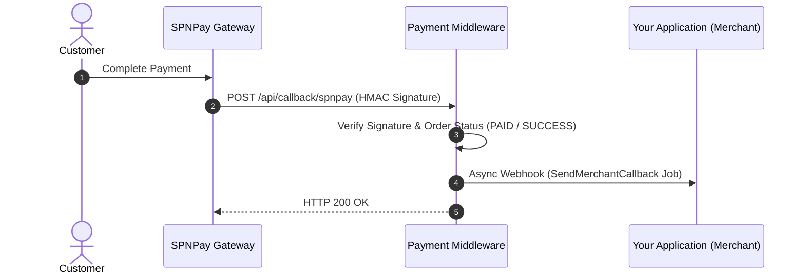

# 🇲🇾 SPNPay Payment Gateway Integration

SPNPay is a payment gateway solution supporting direct ClosedAmount QRIS, Virtual Accounts, and Direct Online Payments.

---

## ⚡ Integration Modes (Codebase Implementation)

| Mode | Status | Technical Implementation in Codebase |
|:---|:---:|:---|
| **🪟 Hosted Payment Portal URL** | ✅ `Supported` | Initial order creation returns a middleware-hosted payment portal URL (`PAYMENT_URL/#/home?reference=...`) for interactive checkout UI. |
| **⚡ Direct Payment API** | ✅ `Supported` | The `POST /api/payment/createPayment` endpoint directly calls the upstream SPNPay API (`url_spnpay/{paymentMethodKey}`) with HMAC-SHA512 header authentication (`On-Key`, `On-Token`, `On-Signature`). |

---

## 1. Credentials Configuration

In the Backoffice under **Payment Repositories**, configure a repository with the gateway key `spnpay` using the following JSON schema:

```json
{
  "spnpay_secretkey": "spn_sec_key_xxxxxxxxxxxxxxxx",
  "spnpay_token": "spn_token_xxxxxxxxxxxxxxxx",
  "url_spnpay": "https://api.spnpay.com"
}
```

### Parameter Description:
| Key | Type | Required | Description |
|:---|:---|:---:|:---|
| `spnpay_secretkey` | string | Yes | Secret Key used to generate HMAC-SHA512 signatures. |
| `spnpay_token` | string | Yes | Merchant Authentication Token provided by SPNPay. |
| `url_spnpay` | string | Yes | Base URL for SPNPay API endpoints. |

---

## 2. Order Creation Flow

### Step 1: Create Order
**`POST /api/order/create`**

```json
{
  "paymentRepositoryId": "019e8383-880a-7249-b9da-079b9844de25",
  "merchantOrderId": "SPN-4001",
  "paymentAmount": 50000,
  "paymentMethod": "QRIS",
  "productDetails": "Digital Product Voucher",
  "mode": "sandbox",
  "firstName": "Rian",
  "lastName": "Pratama",
  "email": "rian@example.com",
  "phone": "08134567890",
  "address": "Surabaya, Indonesia"
}
```

**Response:**
```json
{
  "status": true,
  "code": 200,
  "message": "Success Create Order",
  "data": {
    "reference": "PROJ-SPN-4001",
    "link": "https://payment.sample.com/#/home?reference=PROJ-SPN-4001"
  }
}
```

---

## 3. Webhook / Callback Handling

SPNPay sends HTTP POST notifications to the middleware callback endpoint:

**`POST /api/callback/spnpay`** (or `/api/payment/callbackSPNPay`)



---

## 4. Status Check Endpoint

Inquire transaction status:

**`GET /api/order/checkOrderStatus?reference=PROJ-SPN-4001`**

### Headers:
```http
Token: <YOUR_PROJECT_TOKEN>
```
