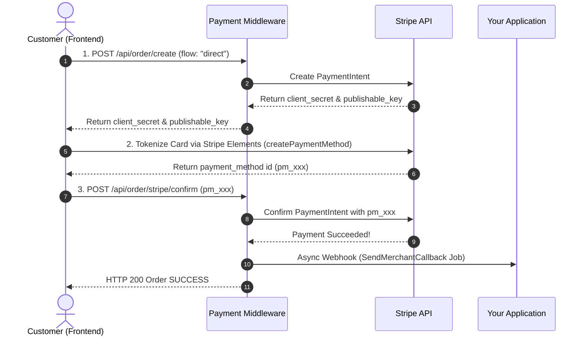

# 🌐 Stripe Payment Gateway Integration

Stripe provides international payment infrastructure supporting Hosted Checkout, Direct PaymentIntent, Stripe Elements tokenization, Apple Pay, Google Pay, FPX, 3D Secure, and 135+ currencies.

---

## ⚡ Integration Modes (Codebase Implementation)

| Mode | Status | Technical Implementation in Codebase |
|:---|:---:|:---|
| **🪟 Stripe Hosted Checkout** | ✅ `Supported` | Invokes `Stripe\Checkout\Session::create()`, returning a hosted Stripe Checkout URL (`link`) with automatic mobile-responsive UI. |
| **⚡ Direct Card / PaymentIntent API** | ✅ `Supported` | Creates a `PaymentIntent` server-side (`flow: "direct"`), tokenized securely on the client with **Stripe Elements / Mobile SDK** (`pm_xxx`), then confirmed via `/api/order/stripe/confirm`. |

---

## 1. Credentials Configuration

In the Backoffice under **Payment Repositories**, configure a repository with the gateway key `stripe` using the following JSON schema:

```json
{
  "stripe_secretkey": "sk_test_51xxxxxxxxxxxxxxxxxxxxxxxxxxxxxxxxxxxxxxxxxxxxxxxxxxxx",
  "stripe_publishablekey": "pk_test_51xxxxxxxxxxxxxxxxxxxxxxxxxxxxxxxxxxxxxxxxxxxxxxxxxxxx",
  "stripe_webhook_secret": "whsec_xxxxxxxxxxxxxxxxxxxxxxxxxxxxxxxxxxxxxxxxxxxx",
  "surcharge_mode": "middleware_calc",
  "surcharge_rate": 0.03,
  "surcharge_fixed": 1.0,
  "currency_rates": {
    "MYR": 1,
    "USD": 0.22,
    "IDR": 3500
  }
}
```

### Parameter Description:
| Key | Type | Required | Description |
|:---|:---|:---:|:---|
| `stripe_secretkey` | string | Yes | Secret API Key (`sk_test_...` or `sk_live_...`). |
| `stripe_publishablekey` | string | Yes | Publishable API Key (`pk_test_...` or `pk_live_...`) returned for Stripe.js. |
| `stripe_webhook_secret` | string | No | Webhook signing secret (`whsec_...`) for webhook signature verification. |
| `surcharge_mode` | string | No | Surcharge calculation mode: `none`, `middleware_calc`, or `stripe_auto`. |
| `surcharge_rate` | float | No | Percentage surcharge fee (e.g. `0.03` for 3%). |
| `surcharge_fixed` | float | No | Fixed surcharge fee in base currency. |
| `currency_rates` | object | No | Currency exchange rates for multi-currency surcharge calculation. |

---

## 2. Integration Flows

### Flow A: 🪟 Hosted Checkout (Simple & Recommended)

Customers are redirected to Stripe's hosted checkout page.

**Request:** `POST /api/order/create` (without `flow` or with `flow: "hosted"`)

```json
{
  "paymentRepositoryId": "019e8383-880a-7249-b9da-079b9844de25",
  "merchantOrderId": "STR-5001",
  "paymentAmount": 150,
  "currency": "myr",
  "productDetails": "Pro Plan Subscription",
  "mode": "sandbox",
  "email": "customer@example.com",
  "returnUrl": "https://yourapp.com/payment/finish"
}
```

**Response:**
```json
{
  "status": true,
  "code": 200,
  "message": "Success Create Order",
  "reference": "PROJ-STR-5001",
  "merchantOrderId": "STR-5001",
  "publishable_key": "pk_test_...",
  "link": "https://checkout.stripe.com/c/pay/cs_test_..."
}
```

---

### Flow B: ⚡ Direct Card / PaymentIntent (Seamless Elements)



#### Step 1: Create Order (`flow: "direct"`)
```json
{
  "merchantOrderId": "STR-5002",
  "paymentAmount": 150,
  "currency": "myr",
  "flow": "direct",
  "mode": "prod"
}
```

#### Step 2: Confirm Payment (`POST /api/order/stripe/confirm`)
```json
{
  "reference": "PROJ-STR-5002",
  "payment_method": "pm_1Nx..."
}
```
*(For local sandbox testing, test tokens like `"token": "tok_visa"` are fully supported).*

---

## 3. Webhook / Callback Handling

Stripe sends webhook events to:

**`POST /api/callback/stripe`**

### Verification:
The middleware validates the `stripe-signature` header using the configured `stripe_webhook_secret`.

---

## 4. Automatic Minor Unit Conversion
- `paymentAmount` sent in the request is the **nominal amount** (e.g. `150` = RM150.00).
- The middleware automatically converts the amount to minor units (×100) for Stripe.
