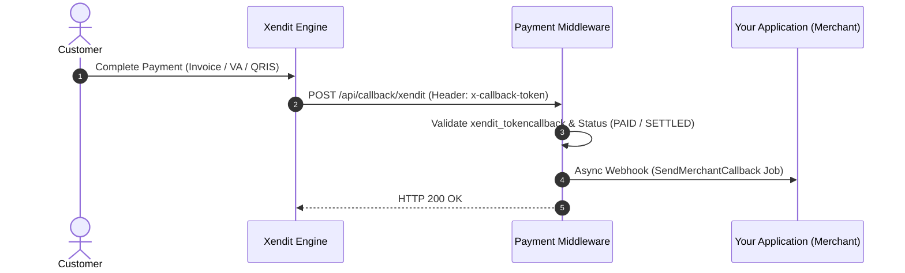

# 🌏 Xendit Payment Gateway Integration

Xendit is a leading payment gateway across Southeast Asia supporting Hosted Invoices (Virtual Accounts, QRIS, E-Wallets, Direct Debit, Credit Cards).

---

## ⚡ Integration Modes (Codebase Implementation)

| Mode | Status | Technical Implementation in Codebase |
|:---|:---:|:---|
| **🪟 XenInvoice (Hosted Checkout URL)** | ✅ `Supported` | Invokes `Xendit\Invoice\InvoiceApi->createInvoice()`, returning an official hosted invoice URL (`invoice_url`) and redirect link. |
| **⚡ Direct API (Headless API)** | 🔄 `Via XenInvoice API` | Order creation routes through Xendit's Invoice API, providing multiple payment channels through a single checkout session. |

---

## 1. Credentials Configuration

In the Backoffice under **Payment Repositories**, configure a repository with the gateway key `xendit` using the following JSON schema:

```json
{
  "xendit_secretkey": "xnd_development_xxxxxxxxxxxxxxxxxxxxxxxxxxxxxxxx",
  "xendit_tokencallback": "webhook_verification_token_xxxxxxxx"
}
```

### Parameter Description:
| Key | Type | Required | Description |
|:---|:---|:---:|:---|
| `xendit_secretkey` | string | Yes | Secret API Key from Xendit Dashboard (`xnd_development_...` or `xnd_production_...`). |
| `xendit_tokencallback` | string | Yes | Webhook verification token to authenticate the incoming `x-callback-token` header. |

---

## 2. Order Creation Flow (Invoice / Checkout)

Endpoint for creating payment orders:

**`POST /api/order/create`**

### Headers:
```http
Content-Type: application/json
Token: <YOUR_PROJECT_TOKEN>
```

### Request Payload:
```json
{
  "paymentRepositoryId": "019e8383-880a-7249-b9da-079b9844de25",
  "merchantOrderId": "XND-3001",
  "paymentAmount": 100000,
  "productDetails": "Medical Consultation Fee",
  "mode": "sandbox",
  "firstName": "Jane",
  "lastName": "Smith",
  "email": "jane.smith@example.com",
  "phone": "08129876543",
  "returnUrl": "https://yourapp.com/payment/success"
}
```

### Success Response:
```json
{
  "message": "Success Create Order",
  "link": "https://checkout-staging.xendit.co/v2/64a...",
  "data": {
    "id": "64a...",
    "external_id": "PROJ-XND-3001",
    "invoice_url": "https://checkout-staging.xendit.co/v2/64a...",
    "status": "PENDING",
    "amount": 100000,
    "expiry_date": "2026-08-21T16:00:00.000Z"
  }
}
```

---

## 3. Webhook / Callback Handling

Xendit sends HTTP POST notifications to the middleware callback endpoint:

**`POST /api/callback/xendit`**



### Verification:
The middleware compares the incoming `x-callback-token` header with the configured `xendit_tokencallback` using secure timing-safe `hash_equals()`.

---

## 4. Status Check Endpoint

Inquire transaction status:

**`GET /api/order/checkOrderStatus?reference=PROJ-XND-3001`**

### Headers:
```http
Token: <YOUR_PROJECT_TOKEN>
```
